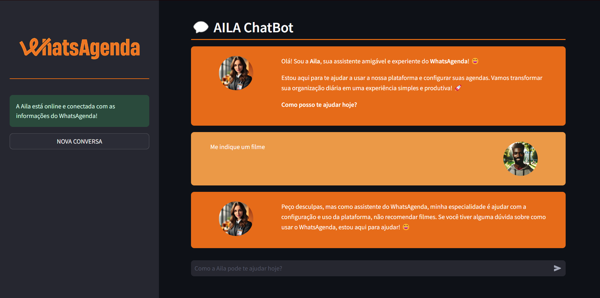

# 🗓️ WhatsAgenda Chatbot for Calendar Configuration

🎉 Welcome to **WhatsAgenda Chatbot for Calendar Configuration**! This chatbot is designed to assist WhatsAgenda customers in setting up their schedules. The tool streamlines scheduling, appointment management, and customization of service hours, ensuring an efficient and user-friendly experience. By combining the latest retrieval-augmented generation (RAG) technologies, we offer a robust and innovative solution for your scheduling needs.




## 📑 Table of Contents

- [Project Description](#-whatsagenda-chatbot-for-calendar-configuration)
- [Project Objectives](#-project-objectives)
- [Main Features](#-main-features)
- [Technologies Used](#-technologies-used)
- [Project Structure](#-project-structure)
- [Running the Project](#-running-the-project)
- [Next Steps (Future Features)](#-next-steps-future-features)
- [License](#-license)
- [How to Contribute](#-how-to-contribute)
- [Author and Contact](#-author-and-contact)

## 🎯 Project Objectives

The main objective of this chatbot is to simplify and optimize the scheduling configuration process for WhatsAgenda users, ensuring a personalized and efficient experience. It aims to:

- Assist WhatsAgenda customers in setting up their schedules.
- Simplify the scheduling and appointment management process.
- Offer an easy-to-use interface for customizing service hours.

## 🔍 Main Features

- **Schedule Configuration:** The chatbot guides the user through the steps of setting up the schedule.
- **Dynamic Data Retrieval:** Uses RAG to provide precise and contextual responses based on company data.
- **User-Friendly Interface:** Developed with Streamlit for a smooth and accessible user experience.

## 🛠️ Technologies Used

- **Python**: Main programming language.
- **LangChain**: For conversation logic and natural language processing.
- **Hugging Face Embeddings and FAISS**: For efficient information storage and retrieval.
- **Streamlit**: For creating the user interface.
- **Groq API and Llama3-70b-8192**: For high-performance processing and large-scale language modeling.
- **LangSmith (Optional)**: For tracking and evaluating conversation quality.

## 📁 Project Structure

The project is organized as follows:

- `config/`: Contains configuration files, such as environment variables.
- `data/`: Data and storage files.
- `docs/`: Relevant documentation and user guides.
- `notebooks/`: Jupyter Notebook files for analyses and experiments.
- `prints/`: Application screenshots.
- `scripts/`: Auxiliary scripts for specific tasks.
- `src/`: Application source code.
- `venv/`: Python virtual environment.
- `.gitignore`: Git configuration file.
- `LICENSE`: Project license.
- `README_ptbr.md`: README in Portuguese.
- `README.md`: README in English.
- `requirements.txt`: Project dependencies list.
- `setup.bat`: Script to install dependencies and run the chatbot on Windows.
- `setup.sh`: Script to install dependencies and run the chatbot on Linux.

```
whatsagenda-chatbot-for-calendar-configuration/
├── config/
│   ├── .env
│   └── .env.example
├── data/
│   ├── vectorstore/
│   └── whatsagenda-data.pdf
├── docs/
│   ├── commits_pattern_ptbr.md
│   └── commits_pattern.md
├── notebooks/
│   └── dependecies_list.ipynb
├── prints/
│   ├── chatbot_1.png
│   └── chatbot_2.png
├── scripts/
│   └── vectorstore_create.py
├── src/
│   ├── assets/
│   |   ├── ai_profile_photo.png
│   |   ├── favicon.ico
│   |   ├── human_profile_photo.png
|   |   └── vertical_logo.png
│   ├── app.py
│   ├── functions.py
│   ├── html_templates.py
│   └── models.py
├── venv/
├── .gitignore
├── LICENSE
├── README_ptbr.md
├── README.md
├── requirements.txt
├── setup.bat
└── setup.sh
```

## 🚀 Running the Project

### On Linux (Method 1):
To run the chatbot locally, follow these steps:
1. Clone the repository:
   ```
   git clone https://github.com/brunotanabe/whatsagenda-chatbot-for-calendar-configuration.git
   ```
2. Navigate to the project directory:
   ```
   cd whatsagenda-chatbot-for-calendar-configuration
   ```
3. Install `pip` and `venv` if not already installed:
   ```
   sudo apt-get update && sudo apt-get install python3-pip python3-venv
   ```
4. Create a virtual environment:
   ```
   python3 -m venv venv
   ```
5. Activate the virtual environment:
   ```
   source venv/bin/activate
   ```
6. Install the dependencies:
   ```
   pip install -r requirements.txt
   ```
7. Run Streamlit:
   ```
   python3 -m streamlit run src/app.py
   ```
NOTE: Run the above commands in the project's root directory.

### On Linux (Method 2):
Run the `setup.sh` script to install dependencies and run the chatbot:
1. Clone the repository:
   ```
   git clone https://github.com/brunotanabe/whatsagenda-chatbot-for-calendar-configuration.git
   ```
2. Navigate to the project directory:
   ```
   cd whatsagenda-chatbot-for-calendar-configuration
   ```
3. Grant execute permission to the script:
   ```
   chmod +x setup.sh
   ```
4. Run the script:
   ```
   ./setup.sh
   ```
NOTE: Run the above commands in the project's root directory.

### On Windows (Method 1):
To run the chatbot locally, follow these steps:
1. Clone the repository:
   ```
   git clone https://github.com/brunotanabe/whatsagenda-chatbot-for-calendar-configuration.git
   ```
2. Navigate to the project directory:
   ```
   cd whatsagenda-chatbot-for-calendar-configuration
   ```
3. Install `pip` and `venv` if not already installed:
   ```
   python -m ensurepip --upgrade
   ```
4. Create a virtual environment:
   ```
   python -m venv venv
   ```
5. Activate the virtual environment:
   ```
   venv\Scripts\activate
   ```
6. Install the dependencies:
   ```
   pip install -r requirements.txt
   ```
7. Run Streamlit:
   ```
   python -m streamlit run src/app.py
   ```
NOTE: Run the above commands in the project's root directory.

### On Windows (Method 2):
Run the `setup.bat` script to install dependencies and run the chatbot:
1. Clone the repository:
   ```
   git clone https://github.com/brunotanabe/whatsagenda-chatbot-for-calendar-configuration.git
   ```
2. Navigate to the project directory:
   ```
   cd whatsagenda-chatbot-for-calendar-configuration
   ```
3. Run the script:
   ```
   setup.bat
   ```
NOTE: Run the above commands in the project's root directory.

## 🌟 Next Steps

- Currently, the variable receiving the response from the llm receives chunks of the message, but it only displays the response when it is complete. To improve the user experience, it would be interesting to display the response chunk by chunk.
- Currently, the user can send a new message while the model is still responding to the previous request, which usually breaks the application. It would be useful to implement a mechanism that prevents the user from sending a new message while the model is still responding to the previous request.

## ❗ Important Note
- If you wish to use your own database, simply create it using the `scripts/vectorstore_create.py` file and modify the `src/functions.py` file to use your database.
- The app runs on `localhost:8501`, but you can change the port in the `.streamlit/config.toml` file.

## 📜 License

Distributed under the MIT License. See `LICENSE` for more information.

## 🤝 How to Contribute

Contributions are what make the open-source community such an amazing place to learn, inspire, and create. Any contributions you make are **greatly appreciated**.

1. Fork the project
2. Create your Feature Branch (`git checkout -b feature/NewFeature`)
3. Commit your changes (`git commit -m 'Add some NewFeature'`)
4. Push to the Branch (`git push origin feature/NewFeature`)
5. Open a Pull Request

## 📬 Author and Contact

- **Bruno Tanabe**
- [GitHub: BrunoTanabe](https://github.com/BrunoTanabe)
- [LinkedIn: Bruno Tanabe](https://www.linkedin.com/in/tanabebruno/)
- [Email: tanabebruno@gmail.com](mailto:tanabebruno@gmail.com)

---

I hope you enjoy using WhatsAgenda Chatbot for Calendar Configuration! For any questions or suggestions, feel free to get in touch. 🚀