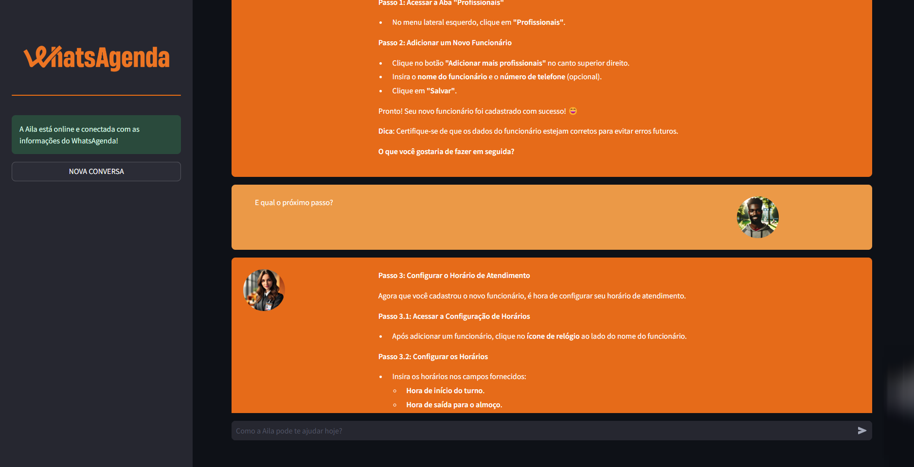
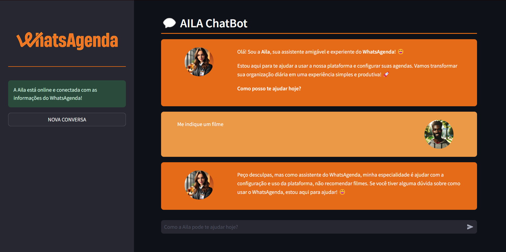

# 🗓️ WhatsAgenda Chatbot for Calendar Configuration

🎉 Bem-vindo ao **WhatsAgenda Chatbot for Calendar Configuration**! Este chatbot foi projetado para auxiliar os clientes do WhatsAgenda na configuração de suas agendas. A ferramenta agiliza o agendamento, gerenciamento de compromissos e personalização de horários de atendimento, garantindo uma experiência eficiente e fácil de usar. Combinando as mais recentes tecnologias de geração de linguagem aumentada por recuperação (RAG), oferecemos uma solução robusta e inovadora para suas necessidades de agendamento.nta para oferecer uma interação intuitiva e um suporte detalhado sobre como gerenciar e personalizar compromissos, horários de atendimento e muito mais.





## 📑 Sumário

- [Descrição do Projeto](#-whatsagenda-chatbot-para-configuração-de-calendário)
- [Objetivos do Projeto](#-objetivos-do-projeto)
- [Funcionalidades Principais](#-funcionalidades-principais)
- [Tecnologias Utilizadas](#-tecnologias-utilizadas️)
- [Estrutura do Projeto](#-estrutura-do-projeto)
- [Executando o Projeto](#-executando-o-projeto)
- [Próximos Passos (Features Futuras)](#-próximos-passos-features-futuras)
- [Licença](#-licença)
- [Como Contribuir](#-como-contribuir)
- [Autor e Contato](#-autor-e-contato)

## 🎯 Objetivos do Projeto

O principal objetivo deste chatbot é simplificar e otimizar o processo de configuração de agenda para os usuários da WhatsAgenda, garantindo uma experiência personalizada e eficiente. Ele visa:

- Auxiliar os clientes do WhatsAgenda na configuração de suas agendas.
- Simplificar o processo de agendamento e gerenciamento de compromissos.
- Oferecer uma interface fácil de usar para personalização de horários de atendimento.

## 🔍 Funcionalidades Principais

- **Configuração da Agenda:** O chatbot guia o usuário através das etapas de configuração da agenda.
- **Consulta Dinâmica de Dados:** Utiliza RAG para fornecer respostas precisas e contextuais baseadas nos dados da empresa.
- **Interface Amigável:** Desenvolvido com Streamlit para uma experiência de usuário suave e acessível.

## 🛠️ Tecnologias Utilizadas️

- **Python**: Linguagem principal de programação.
- **LangChain**: Para a lógica de conversação e processamento de linguagem natural.
- **Hugging Face Embeddings e FAISS**: Para o armazenamento e recuperação eficiente de informações.
- **Streamlit**: Para criação da interface do usuário.
- **API da Groq e Llama3-70b-8192**: Para o processamento de alto desempenho e modelagem de linguagem de grande escala.
- **LangSmith (Opcional)**: Para rastrear e avaliar a qualidade da conversa.

## 📁 Estrutura do Projeto

O projeto está organizado da seguinte maneira:

- `.streamlit/`: Contém arquivos de configuração do Streamlit.
- `config/`: Contém arquivos de configuração, como variáveis de ambiente.
- `data/`: Dados e arquivos de armazenamento.
- `docs/`: Documentação relevante e guias de usuário.
- `notebooks/`: Com arquivos Jupyter Notebook para análises e experimentos.
- `prints/`: Capturas de tela da aplicação.
- `scripts/`: Scripts auxiliares para tarefas específicas.
- `src/`: Código-fonte da aplicação.
- `venv/`: Ambiente virtual Python.
- `.gitignore`: Arquivo de configuração do Git.
- `LICENSE`: Licença do projeto.
- `README_ptbr.md`: README em português.
- `README.md`: README em inglês.
- `requirements.txt`: Lista de dependências do projeto.
- `setup.bat`: Script para instalar dependências e executar o chatbot no Windows.
- `setup.sh`: Script para instalar dependências e executar o chatbot no Linux.

```
whatsagenda-chatbot-for-calendar-configuration/
├── .streamlit/
├── config/
│   ├── .env
│   └── .env.example
├── data/
│   ├── vectorstore/
│   └── whatsagenda-data.pdf
├── docs/
│   ├── commits_pattern_ptbr.md
│   └── commits_pattern.md
├── notebooks/
│   └── dependecies_list.ipynb
├── prints/
│   ├── chatbot_1.png
│   └── chatbot_2.png
├── scripts/
│   └── vectorstore_create.py
├── src/
│   ├── assets/
│   │   ├── favicon.ico
│   │   └── vertical_logo.png
│   ├── static/
│   │   ├── ai_profile_photo.png
│   │   └── human_profile_photo.png
│   ├── app.py
│   ├── functions.py
│   ├── html_templates.py
│   └── models.py
├── venv/
├── .gitignore
├── LICENSE
├── README_ptbr.md
├── README.md
├── requirements.txt
├── setup.bat
└── setup.sh
```

## 🚀 Executando o Projeto

### No Linux (Método 1):
Para executar o chatbot localmente, siga os passos abaixo:
1. Clone o repositório:
   ```
   git clone https://github.com/brunotanabe/whatsagenda-chatbot-for-calendar-configuration.git
   ```
2. Acesse o diretório do projeto:
   ```
   cd whatsagenda-chatbot-for-calendar-configuration
   ```
3. Instale o `pip` e `venv`, caso ainda não estejam instalados:
   ```
   sudo apt-get update && sudo apt-get install python3-pip python3-venv
   ```
4. Crie um ambiente virtual:
   ```
   python3 -m venv venv
   ```
5. Ative o ambiente virtual:
   ```
   source venv/bin/activate
   ```
6. Instale as dependências:
   ```
   pip install -r requirements.txt
   ```
7. Execute o Streamlit:
   ```
   python3 -m streamlit run src/app.py
   ```
NOTA: Execute os comandos acima na pasta principal do projeto.

### No Linux (Método 2):
Execute o script `setup.sh` para instalar as dependências e executar o chatbot:
1. Clone o repositório:
   ```
   git clone https://github.com/brunotanabe/whatsagenda-chatbot-for-calendar-configuration.git
   ```
2. Acesse o diretório do projeto:
   ```
   cd whatsagenda-chatbot-for-calendar-configuration
   ```
3. Dê permissão de execução ao script:
   ```
   chmod +x setup.sh
   ```
4. Execute o script:
   ```
   ./setup.sh
   ```
NOTA: Execute os comandos acima na pasta principal do projeto.

### No Windows (Método 1):
Para executar o chatbot localmente, siga os passos abaixo:
1. Clone o repositório:
   ```
   git clone https://github.com/brunotanabe/whatsagenda-chatbot-for-calendar-configuration.git
   ```
2. Acesse o diretório do projeto:
   ```
   cd whatsagenda-chatbot-for-calendar-configuration
   ```
3. Instale o `pip` e `venv`, caso ainda não estejam instalados:
   ```
   python -m ensurepip --upgrade
   ```
4. Crie um ambiente virtual:
   ```
   python -m venv venv
   ```
5. Ative o ambiente virtual:
   ```
   venv\Scripts\activate
   ```
6. Instale as dependências:
   ```
   pip install -r requirements.txt
   ```
7. Execute o Streamlit:
   ```
   python -m streamlit run src/app.py
   ```
NOTA: Execute os comandos acima na pasta principal do projeto.

### No Windows (Método 2):
Execute o script `setup.bat` para instalar as dependências e executar o chatbot:
1. Clone o repositório:
   ```
   git clone https://github.com/brunotanabe/whatsagenda-chatbot-for-calendar-configuration.git
   ```
2. Acesse o diretório do projeto:
   ```
   cd whatsagenda-chatbot-for-calendar-configuration
   ```
3. Execute o script:
   ```
   setup.bat
   ```
NOTA: Execute os comandos acima na pasta principal do projeto.

## 🌟 Próximos Passos

- Atualmente, a variável que recebe a resposta do llm recebe recebe chunk a chunk da mensagem, no entanto, ela só é exibe a resposta quando está completa, para melhorar a experiência do usuário, seria interessante exibir a resposta chunk a chunk.
- Atualmente, o usuário pode mandar uma nova mensagem enquanto o modelo ainda está respondendo a solicitação anterior, isso normalmente quebra a aplicação, seria interessante implementar um mecanismo que impeça o usuário de mandar uma nova mensagem enquanto o modelo ainda está respondendo a solicitação anterior. 

## ❗ Nota Importante
- Se você desejar usar sua própria base de dados basta cria-la utilizando o arquivo  substituir o arquivo `scripts/vectorstore_create.py` e alterar o arquivo `src/functions.py` para que ele utilize a sua base de dados.
- O app é executado em `localhost:8501`, mas você pode alterar a porta no arquivo `.streamlit/config.toml`.

## 📜 Licença

Distribuído sob a licença MIT. Veja `LICENSE` para mais informações.

## 🤝 Como Contribuir

Contribuições são o que fazem a comunidade open source um lugar incrível para aprender, inspirar e criar. Quaisquer contribuições que você fizer são **muito apreciadas**.

1. Faça um Fork do projeto
2. Crie sua Feature Branch (`git checkout -b feature/NovaFeature`)
3. Faça commit de suas mudanças (`git commit -m 'Add some NovaFeature'`)
4. Push para a Branch (`git push origin feature/novaFeature`)
5. Abra um Pull Request

## 📬 Autor e Contato

- **Bruno Tanabe**
- [GitHub: BrunoTanabe](https://github.com/BrunoTanabe)
- [Linkedin: Bruno Tanabe](https://www.linkedin.com/in/tanabebruno/)
- [Email: tanabebruno@gmail.com](mailto:tanabebruno@gmail.com.com)

---

Espero que você aproveite a utilização do WhatsAgenda Chatbot for Calendar Configuration! Para qualquer dúvida ou sugestão, não hesite em entrar em contato. 🚀